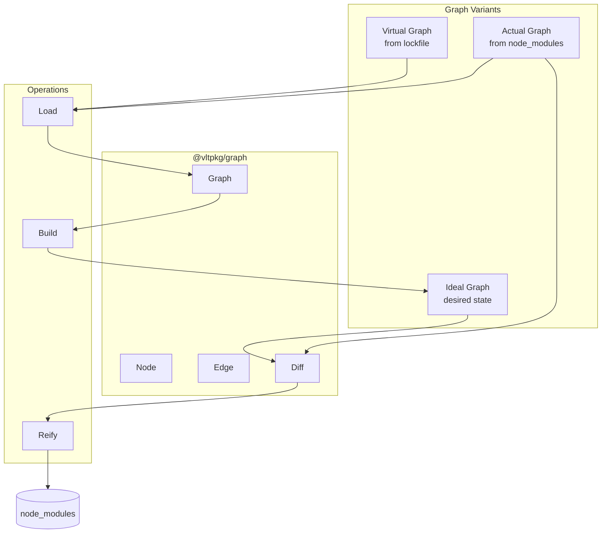
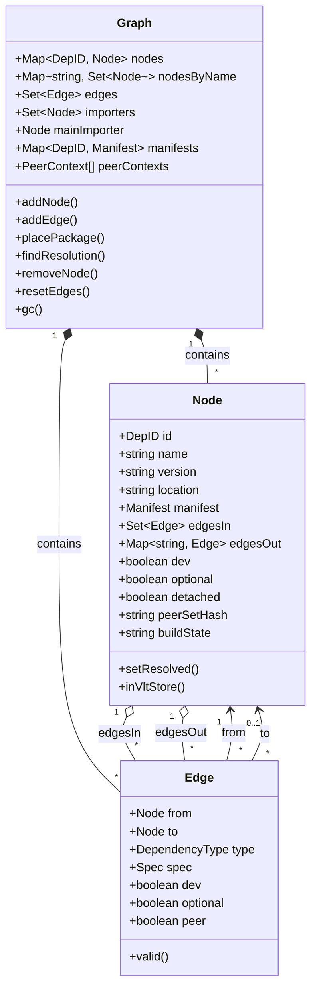
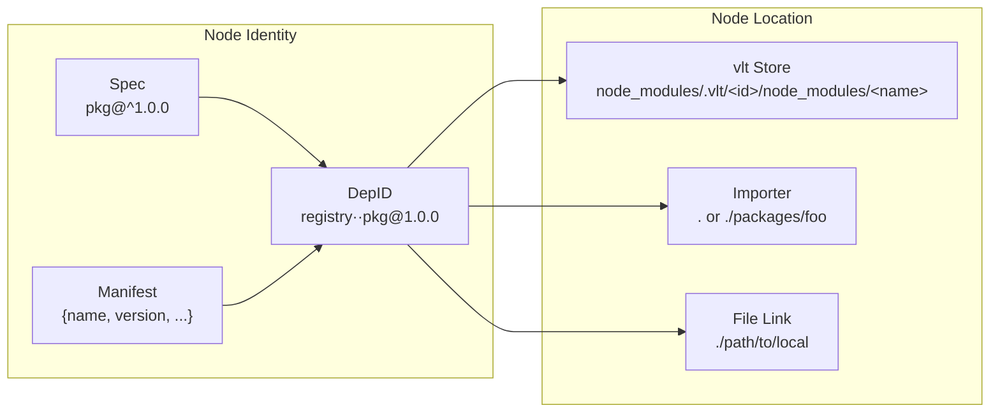
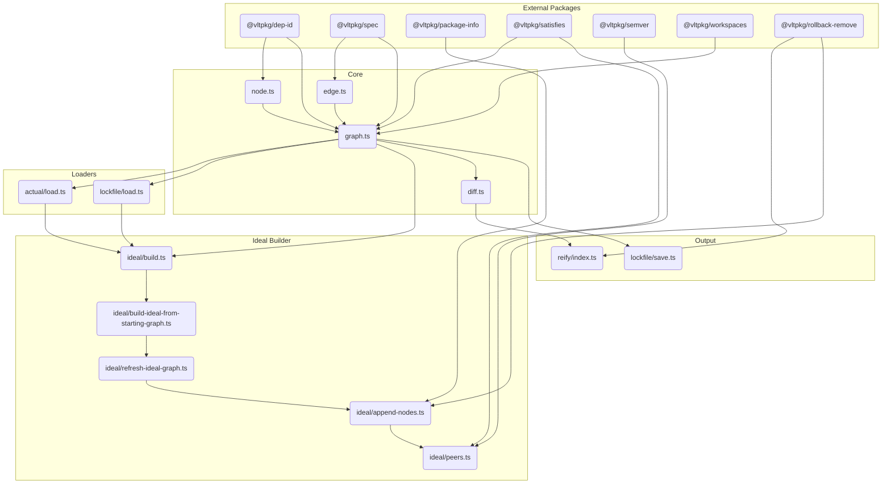
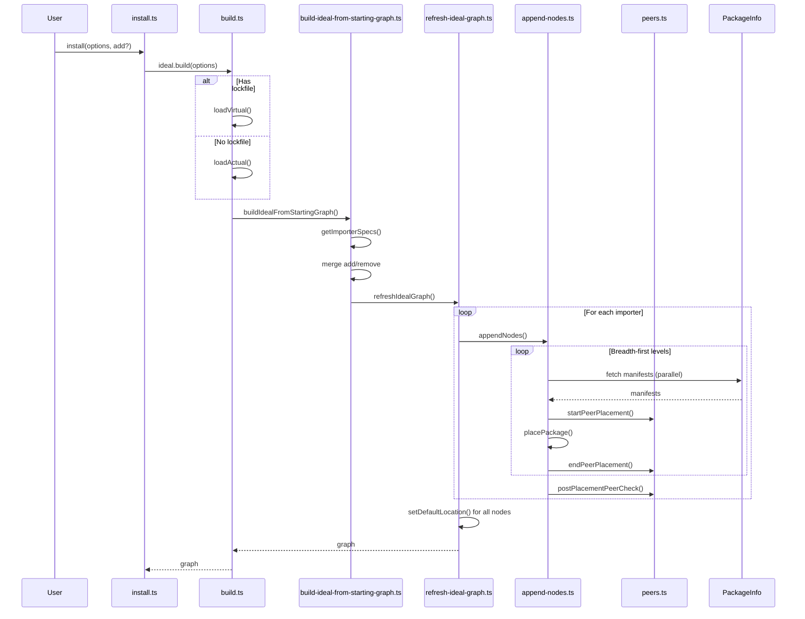
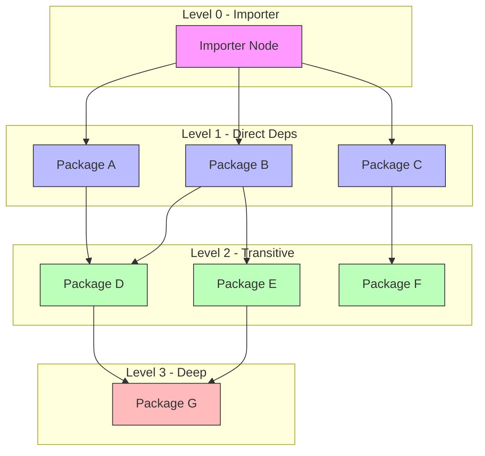
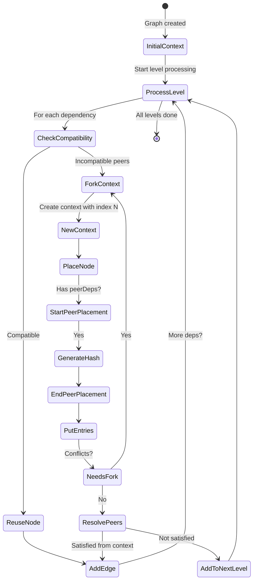
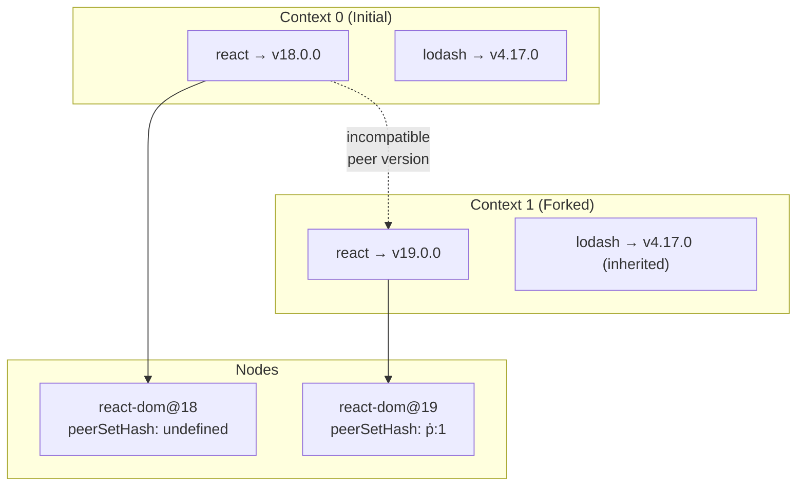
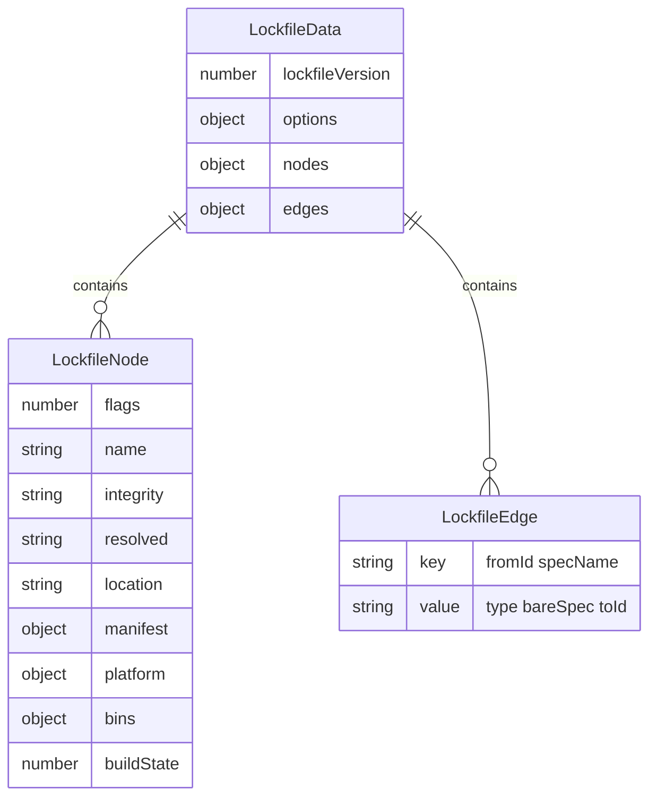
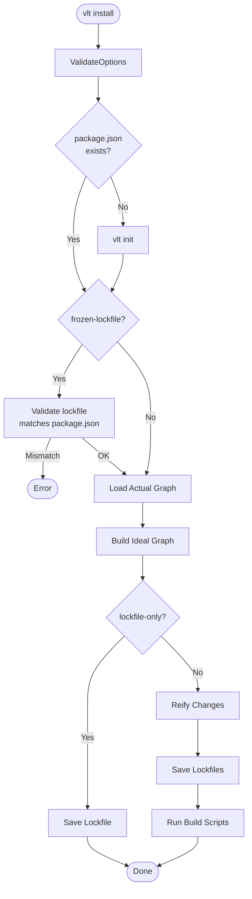

# @vltpkg/graph Architecture

This document provides an architectural overview of the
`@vltpkg/graph` library for new team members.

## Overview

The graph library models a JavaScript/TypeScript project's dependency
universe. It is the foundation for computing and applying changes to
`node_modules`.



## Core Data Structures

### Graph, Node, and Edge Relationships



### Node Identity and Location



## Module Architecture

### Directory Structure

```
src/graph/src/
├── index.ts           # Public API exports
├── graph.ts           # Graph class
├── node.ts            # Node class
├── edge.ts            # Edge class
├── diff.ts            # Diff computation
├── dependencies.ts    # Dependency helpers
├── modifiers.ts       # Graph modifiers (DSS queries)
├── actual/            # Actual graph loading
│   └── load.ts
├── ideal/             # Ideal graph building
│   ├── build.ts
│   ├── build-ideal-from-starting-graph.ts
│   ├── refresh-ideal-graph.ts
│   ├── append-nodes.ts
│   ├── peers.ts
│   ├── get-importer-specs.ts
│   ├── get-ordered-dependencies.ts
│   └── types.ts
├── lockfile/          # Lockfile operations
│   ├── load.ts
│   ├── save.ts
│   └── types.ts
├── reify/             # Apply changes to disk
│   ├── index.ts
│   └── extract-node.ts
└── visualization/     # Graph output formats
    ├── mermaid-output.ts
    ├── human-readable-output.ts
    ├── json-output.ts
    └── object-like-output.ts
```

### Module Dependencies



## Graph Building Pipeline

### Ideal Graph Build Flow



### Breadth-First Node Processing



All nodes at each level are processed in parallel, with manifest
fetches happening concurrently.

## Peer Dependency Resolution

### Peer Context Lifecycle



### Peer Context Forking



When a package requires a different peer version than what's in the
current context, a new context is forked and the node gets a unique
`peerSetHash`.

## Lockfile Format

### Data Structure



### Node Flags

| Flag Value | Meaning               |
| ---------- | --------------------- |
| 0          | Production dependency |
| 1          | Optional dependency   |
| 2          | Dev dependency        |
| 3          | Dev + Optional        |

## Installation Flow



## Key Concepts

### DepID (Dependency ID)

Unique identifier for a package instance:

- `registry··pkg@1.0.0` - Registry package
- `file·./local/path` - Local file/folder
- `git·github.com/user/repo#commit` - Git dependency
- `workspace·packages/foo` - Workspace package

### Resolution Cache

The graph maintains resolution caches for performance:

- `resolutions: Map<string, Node>` - Spec → Node lookup
- `resolutionsReverse: Map<Node, Set<string>>` - Node → Specs reverse
  lookup

Cache keys combine:
`spec + fromLocation + extra (modifier + peerSetHash)`

### Detached Nodes

When `graph.resetEdges()` is called:

1. All edges are cleared
2. Nodes with manifests are marked `detached = true`
3. Detached nodes can be reused without re-fetching manifests

### Early Extraction

During ideal graph building, tarballs can be extracted in parallel:

1. Node is placed in graph
2. If node doesn't exist in actual graph → extract immediately
3. Extraction happens via `RollbackRemove` for safe rollback on
   failure

## Visualization Outputs

The `visualization/` module provides multiple graph output formats:

| Format         | Function                | Description                                     |
| -------------- | ----------------------- | ----------------------------------------------- |
| Mermaid        | `mermaidOutput()`       | Flowchart diagram syntax for docs/debugging     |
| Human-readable | `humanReadableOutput()` | ASCII tree with colors (like `npm ls`)          |
| JSON           | `jsonOutput()`          | Array of `{name, fromID, spec, type, to}` items |
| Object-like    | `objectLikeOutput()`    | Node.js `inspect()` output for debugging        |

All outputs accept filtered `{edges, nodes, importers}` from query
results.

## Testing Strategy

- Unit tests in `test/` mirror `src/` structure
- 100% code coverage required
- Use mock `PackageInfoClient` for manifest fetching
- Test peer context forking with real npm packages (e.g., React
  ecosystem)

## Further Reading

- [Cursor Rules](.cursor/rules/graph/) - Detailed implementation
  guides
- [npm package.json docs](https://docs.npmjs.com/cli/configuring-npm/package-json)
- [Semantic Versioning](https://semver.org)
